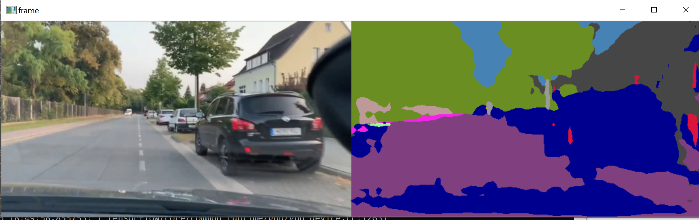
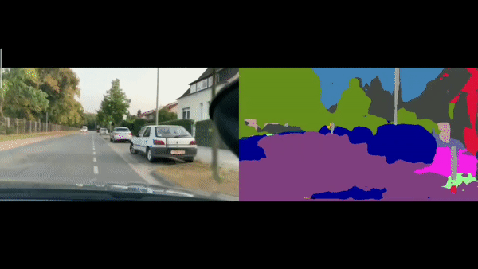

# Semantic-Segmentation-with-DeepLabv3

First download or git clone the repository https://github.com/tensorflow/models/tree/master/research/deepla


## Dependencies

```# For CPU  ``` <br/>
```pip install tensorflow  ```<br/>
```# For GPU ```<br/>
``` pip install tensorflow-gpu ```<br/>

``` pip install numpy ```<br/>
``` pip install pillow ```<br/>
``` pip install scikit-video ```<br/>
``` pip install ffmpeg ```<br/>


## Code execution
To run the code go to terminal and go to tensorflow/models/research/deep and then give this command.


``` python deeplab_cityscape.py ```

You will get both original and segmented image side by side.





###  My Output


<p align="left">
  
</p>
